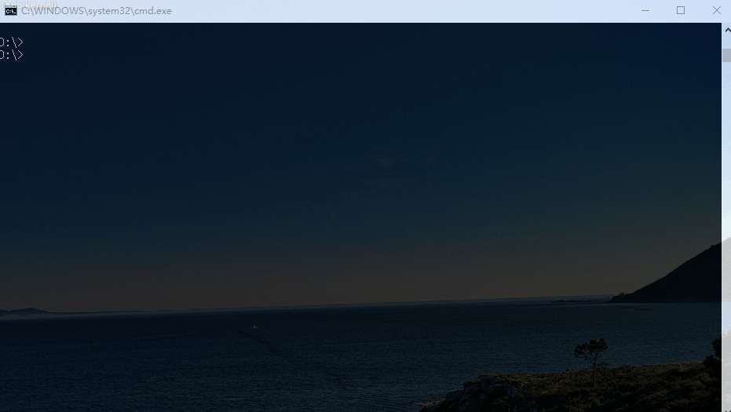

# WDBG

* 是基于微软发布的调试引擎`dbgeng`(WinDbg的调试引擎)开发的调试器
* 并不直接给用户提供UI，而是以`RPC`的形式提供API接口

此项目包含两大模块，一个是用C++编写提供RPC调试服务的，称为WDBG调试器后台；另一个是使用Python封装的调试器前台pywdbg

用户既可以基于RPC接口使用其它编程语言开发扩展，也可以使用C++编写WDBG调试器后台插件并为前台调试器程序提供服务

此外，用户可以使用pywdbg提供的接口在python控制台交互调试，或者根据自己的需求编写python脚本自动化调试

## pywdbg

关于pywdbg的使用，你可以看wiki

## Features

* 支持32位和64位程序调试
* 可通过网络远程调试

## Related project

* srpc: https://github.com/luzhlon/srpc
* xval: https://github.com/luzhlon/xval

## Thanks

* xmake: https://github.com/tboox/xmake/

